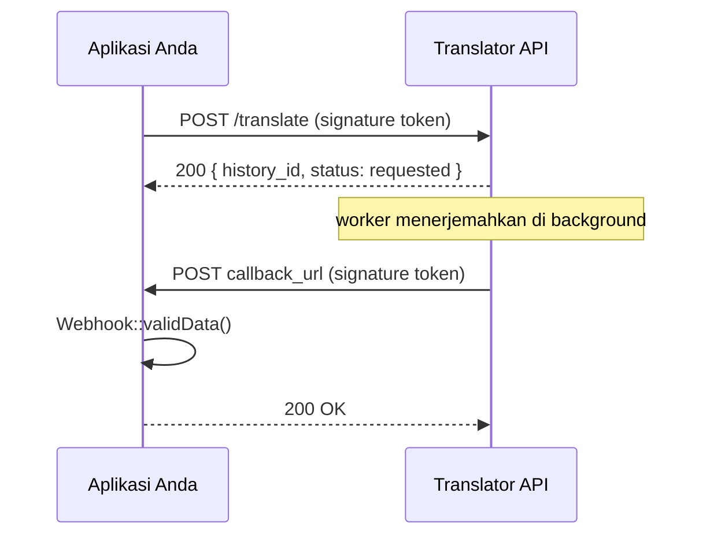

# Translator Client for PHP

Client PHP tanpa dependensi (hanya `curl`) untuk REST API **Translator** — fokus pada alur asynchronous:

1. **Kirim** permintaan terjemahan dengan `Translator::translate()` → `POST /translate` (autentikasi `key_id` + signature token).
2. **Terima** hasilnya di webhook, sudah diverifikasi otomatis oleh `Webhook::validData()`.

Kontrak API lengkap ada di [API_DOC.md](API_DOC.md).

## Persyaratan

- PHP >= 8.1
- ekstensi `curl`

## Instalasi

```bash
composer require trisnawan/translator-client-php
```

## Alur



## 1. Mengirim Terjemahan

`translate()` menandatangani request dengan `secret_key` lalu mengembalikan `data` dari API (`history_id`, `status`, `callback_enabled`, ...). Hasil terjemahan **tidak** dibalas di sini — hasilnya dikirim ke webhook Anda.

```php
use Trisnawan\Translator\Translator;
use Trisnawan\Translator\Exception\ApiException;

$translator = new Translator(
    baseUrl: 'http://localhost:3000',
    accountId: '01a0eea2-221c-70cd-83d0-56e95a65c37b', // UUID akun pemilik key
    keyId: '01a0eea2-2296-71ae-bd0b-9bee0cd7106f',     // id pada account_keys
    secretKey: 'sk_translator_...',                    // hanya diketahui Anda
    from: 'id',                                        // bahasa default
    to: 'en',
);

$result = $translator->translate(
    driver: 'gemini-3.8-flash',
    referenceId: 'INV-2026-0001',
    referenceContent: 'Selamat pagi, apa kabar?',
);

// $result['history_id'], $result['status'], $result['callback_enabled'], ...
```

Bahasa bisa di-override per panggilan:

```php
$translator->translate('gemini-3.8-flash', 'INV-2026-0002', 'Hello', from: 'en', to: 'id');
```

### Parameter `translate()`

| Parameter           | Wajib | Keterangan                                                            |
| ------------------- | ----- | --------------------------------------------------------------------- |
| `$driver`           | ✅    | id driver yang diberikan ke akun, mis. `gemini-3.8-flash`             |
| `$referenceId`      | ✅    | id milik Anda; diikat ke signature token dan dicocokkan saat callback |
| `$referenceContent` | ✅    | teks yang akan diterjemahkan                                          |
| `$from` / `$to`     | –     | override bahasa; default dari constructor                             |

### Parameter constructor

| Parameter       | Default | Keterangan                                               |
| --------------- | ------- | -------------------------------------------------------- |
| `$baseUrl`      | –       | alamat API, mis. `http://localhost:3000`                 |
| `$accountId`    | –       | UUID akun pemilik API key (dipakai pada signature token) |
| `$keyId`        | –       | `id` pada `account_keys`                                 |
| `$secretKey`    | –       | `secret_key` milik key tersebut                          |
| `$from` / `$to` | `null`  | bahasa default untuk semua `translate()`                 |
| `$tokenTtl`     | `300`   | masa berlaku signature token (detik)                     |
| `$timeout`      | `30`    | timeout HTTP request (detik)                             |

Jika `callback_enabled` bernilai `false` (key tanpa `callback_url`), hasil harus diambil manual lewat dashboard/`GET /histories` — di luar cakupan library ini.

## 2. Menerima Callback

Pasang endpoint webhook Anda sebagai `callback_url` pada API key, lalu verifikasi sekaligus baca payload-nya hanya dengan `validData()`:

```php
use Trisnawan\Translator\Webhook;
use Trisnawan\Translator\Exception\WebhookException;

try {
    $data = (new Webhook())->validData($keyId, $secretKey);
} catch (WebhookException $e) {
    http_response_code(401);
    exit($e->getMessage());
}

if ($data['status'] === 'translated') {
    saveTranslation($data['reference_id'], $data['translated_content']);
}

http_response_code(200); // balas 2xx agar server tidak mengirim ulang
```

`validData()` secara otomatis memverifikasi:

- header `key_id` cocok dengan key yang Anda berikan,
- signature token HS256 benar-benar ditandatangani dengan `secret_key` Anda,
- token belum kedaluwarsa,
- `reference_id` pada body sama dengan `reference_id` di dalam token,
- `status` bernilai `translated` atau `failed`.

Semua kegagalan melempar `WebhookException`; payload yang valid dikembalikan sebagai `array`.

> Balas **2xx hanya jika tidak ada exception**, karena selain itu server akan menjadwalkan ulang callback (default 5 menit, maksimal 2 percobaan).

### Payload callback

| Field                | Tipe           | Keterangan                                  |
| -------------------- | -------------- | ------------------------------------------- |
| `status`             | string         | `translated` atau `failed`                  |
| `translate_from`     | string         | kode bahasa sumber                          |
| `translate_to`       | string         | kode bahasa tujuan                          |
| `reference_id`       | string         | sama dengan yang dikirim saat `translate()` |
| `translated_content` | string \| null | hasil terjemahan; `null` bila `failed`      |
| `translated_at`      | string \| null | waktu selesai (ISO 8601)                    |

### Integrasi framework

`validData()` membaca `$_SERVER` + `php://input`. Bila framework Anda punya request sendiri, inject keduanya:

```php
// Laravel / Symfony
$webhook = new Webhook($request->server->all(), $request->getContent());

// Pengujian
$webhook = new Webhook(['HTTP_KEY_ID' => $keyId, 'HTTP_AUTHORIZATION' => 'Bearer ' . $token], $jsonBody);
```

Nama header dicocokkan tanpa peduli bentuk dan huruf besar/kecil — `key_id`, `Key-Id`, maupun `HTTP_KEY_ID` sama-sama dikenali, jadi array mentah dari `getallheaders()` juga bisa di-inject sebagai `$server`.

Bila aplikasi Anda punya beberapa API key, baca header `key_id` lebih dulu untuk menentukan `secret_key` yang sesuai, baru panggil `validData($keyId, $secretKey)`.

## Penanganan Error

| Exception             | Kapan muncul                                                                                     | Info tambahan                    |
| --------------------- | ------------------------------------------------------------------------------------------------ | -------------------------------- |
| `TranslatorException` | base semua error library                                                                         | –                                |
| `ApiException`        | API membalas non-2xx (signature salah, driver tidak diberi akses, quota habis, broker down, ...) | `getStatusCode()`, `getErrors()` |
| `WebhookException`    | callback tidak valid / tidak terautentikasi                                                      | –                                |

```php
try {
    $result = $translator->translate('gemini-3.8-flash', 'INV-1', 'Halo');
} catch (ApiException $e) {
    // $e->getStatusCode() === 429, $e->getErrors() berisi detail quota
} catch (TranslatorException $e) {
    // API tidak dapat dihubungi, payload bukan UTF-8, dsb.
}
```

## Lisensi

MIT — lihat [LICENCE.txt](LICENCE.txt).
